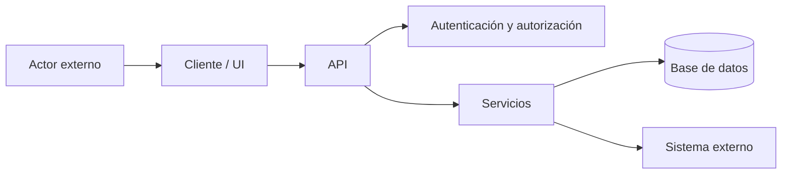

# Informe profesional de seguridad

> Plantilla estándar de FACBGNTO Software Engineering.  
> Los campos marcados como `Pendiente` deben completarse con evidencia verificable.  
> No elimines secciones: usa `No aplica` o explica la limitación.

---

## 1. Control del documento

| Campo | Valor |
|---|---|
| Proyecto | Pendiente |
| Repositorio | Pendiente |
| Módulo / alcance | Pendiente |
| Versión | Pendiente |
| Rama | Pendiente |
| Commit | Pendiente |
| Fecha de inicio | Pendiente |
| Fecha de cierre | Pendiente |
| Analista / agente | Pendiente |
| Skills activados | `facbgnto-software-engineering`, `facbgnto-security-review` |
| Herramientas | Pendiente |
| Clasificación | Uso interno |
| Versión del informe | 1.0 |

### Historial de revisiones

| Versión | Fecha | Commit auditado | Autor | Cambio | Resultado |
|---|---|---|---|---|---|
| 1.0 | Pendiente | Pendiente | Pendiente | Revisión inicial | Pendiente |

---

## 2. Resumen ejecutivo

### 2.1 Conclusión

Describe en lenguaje no técnico:

- estado general de seguridad;
- vulnerabilidades más importantes;
- exposición real;
- controles correctos;
- decisión recomendada de despliegue.

### 2.2 Estado de aprobación

- [ ] Aprobado para producción
- [ ] Aprobado con observaciones
- [ ] No aprobado
- [ ] Requiere revisión adicional

### 2.3 Riesgo global

| Riesgo global | Confianza del informe | Justificación |
|---|---|---|
| Pendiente: Bajo / Medio / Alto / Crítico | Pendiente: Alta / Media / Baja | Pendiente |

### 2.4 Resumen de hallazgos

| Severidad | Confirmados | Potenciales | Corregidos | Aceptados | Pendientes |
|---|---:|---:|---:|---:|---:|
| Crítica | 0 | 0 | 0 | 0 | 0 |
| Alta | 0 | 0 | 0 | 0 | 0 |
| Media | 0 | 0 | 0 | 0 | 0 |
| Baja | 0 | 0 | 0 | 0 | 0 |
| Informativa | 0 | 0 | 0 | 0 | 0 |

### 2.5 Quick wins

| Prioridad | Acción | Esfuerzo | Beneficio | Responsable sugerido |
|---|---|---|---|---|
| P0/P1/P2 | Pendiente | Pendiente | Pendiente | Pendiente |

---

## 3. Alcance y metodología

### 3.1 Incluido

- Archivos:
- Endpoints:
- Flujos:
- Infraestructura:
- Dependencias:
- Configuración:

### 3.2 Fuera de alcance

- Pendiente.

### 3.3 Metodología

- revisión manual de código;
- análisis estático;
- detección de secretos;
- auditoría de dependencias;
- modelado de amenazas;
- verificación de configuración;
- revisión de CI/CD;
- validación de falsos positivos.

### 3.4 Limitaciones

Documenta toda cobertura no realizada:

- pruebas dinámicas no ejecutadas;
- producción no evaluada;
- credenciales no disponibles;
- herramientas no instaladas;
- módulos excluidos;
- dependencia de evidencia parcial.

---

## 4. Métricas de cobertura

| Métrica | Cantidad | Fuente / método |
|---|---:|---|
| Archivos revisados | 0 | Pendiente |
| Líneas inspeccionadas | 0 | Pendiente |
| Endpoints | 0 | Pendiente |
| Controladores | 0 | Pendiente |
| Middlewares | 0 | Pendiente |
| Servicios | 0 | Pendiente |
| Modelos | 0 | Pendiente |
| Migraciones | 0 | Pendiente |
| Consultas SQL | 0 | Pendiente |
| Dependencias | 0 | Pendiente |
| Workflows CI/CD | 0 | Pendiente |
| Diagramas revisados | 0 | Pendiente |
| Falsos positivos descartados | 0 | Pendiente |
| Controles correctos observados | 0 | Pendiente |

### Indicadores

| Indicador | Valor | Interpretación |
|---|---:|---|
| Hallazgos por KLOC | Pendiente | Pendiente |
| Porcentaje del alcance revisado | Pendiente | Pendiente |
| Tiempo estimado de remediación | Pendiente | Pendiente |
| Riesgo residual | Pendiente | Pendiente |

---

## 5. Arquitectura y superficie de ataque

### 5.1 Diagrama



### 5.2 Activos críticos

| Activo | Sensibilidad | Propietario | Impacto de compromiso |
|---|---|---|---|
| Pendiente | Pública / Interna / Confidencial / Restringida | Pendiente | Pendiente |

### 5.3 Entradas y puntos de exposición

| Entrada | Actor | Autenticación | Validación | Rate limit | Riesgo |
|---|---|---|---|---|---|
| Pendiente | Pendiente | Pendiente | Pendiente | Pendiente | Pendiente |

### 5.4 Límites de confianza

| Límite | Origen | Destino | Datos | Controles |
|---|---|---|---|---|
| Pendiente | Pendiente | Pendiente | Pendiente | Pendiente |

---

## 6. Modelo de amenazas

### STRIDE

| ID | Componente | Categoría STRIDE | Amenaza | Probabilidad | Impacto | Controles | Riesgo residual |
|---|---|---|---|---|---|---|---|
| TM-001 | Pendiente | Spoofing / Tampering / Repudiation / Information Disclosure / DoS / Elevation | Pendiente | Pendiente | Pendiente | Pendiente | Pendiente |

---

## 7. Matriz de riesgo

### Escala

| Valor | Probabilidad | Impacto |
|---:|---|---|
| 1 | Rara | Insignificante |
| 2 | Improbable | Menor |
| 3 | Posible | Moderado |
| 4 | Probable | Mayor |
| 5 | Casi segura | Crítico |

**Puntaje = Probabilidad × Impacto**

| Puntaje | Nivel |
|---:|---|
| 1–4 | Bajo |
| 5–9 | Medio |
| 10–16 | Alto |
| 17–25 | Crítico |

### Matriz de hallazgos

| ID | Probabilidad | Impacto | Puntaje | Severidad | Prioridad |
|---|---:|---:|---:|---|---|
| SEC-001 | 0 | 0 | 0 | Pendiente | Pendiente |

---

## 8. Hallazgos

> Crea una sección por hallazgo. No incluyas hallazgos sin evidencia.

### SEC-001 — Título descriptivo

| Campo | Valor |
|---|---|
| Severidad | Crítica / Alta / Media / Baja / Informativa |
| Confianza | Alta / Media / Baja |
| Estado | Confirmado / Potencial / Falso positivo / Corregido / Aceptado |
| Probabilidad | 1–5 |
| Impacto | 1–5 |
| Puntaje de riesgo | 1–25 |
| CVSS | No aplica o vector y puntaje |
| OWASP Top 10 | Pendiente |
| OWASP API Top 10 | Pendiente |
| OWASP ASVS | Pendiente |
| CWE | Pendiente |
| MITRE ATT&CK | Cuando aplique |
| Responsable | Pendiente |
| Fecha objetivo | Pendiente |

#### Descripción

Pendiente.

#### Ubicación

- Archivo:
- Líneas:
- Función / endpoint:
- Commit:

#### Evidencia

```text
Incluye fragmentos mínimos, comandos y resultados sanitizados.
Nunca incluyas secretos completos.
```

#### Impacto

Pendiente.

#### Escenario de abuso defensivo

Describe precondiciones, secuencia y consecuencia sin entregar instrucciones destructivas.

#### Causa raíz

Pendiente.

#### Controles existentes

Pendiente.

#### Recomendación

Pendiente.

#### Código o configuración sugerida

```text
Pendiente.
```

#### Validación de la corrección

- prueba automatizada;
- comprobación manual;
- resultado esperado;
- evidencia posterior.

#### Riesgo residual del hallazgo

Pendiente.

---

## 9. Falsos positivos y hallazgos descartados

| ID herramienta | Herramienta | Ubicación | Motivo del descarte | Evidencia manual |
|---|---|---|---|---|
| FP-001 | Pendiente | Pendiente | Pendiente | Pendiente |

---

## 10. Controles correctos observados

| Control | Ubicación | Evidencia | Cobertura | Observación |
|---|---|---|---|---|
| Pendiente | Pendiente | Pendiente | Completa / Parcial | Pendiente |

Ejemplos:

- consultas parametrizadas;
- cookies seguras;
- token rotation;
- bloqueo por fuerza bruta;
- auditoría;
- aislamiento multi-tenant;
- validación de entradas;
- gestión segura de errores.

---

## 11. Mapeo de cumplimiento

### OWASP y CWE

| Hallazgo | OWASP Top 10 | OWASP API | ASVS | CWE | Estado |
|---|---|---|---|---|---|
| SEC-001 | Pendiente | Pendiente | Pendiente | Pendiente | Pendiente |

### Marcos adicionales

| Control / hallazgo | NIST SSDF | ISO 27001 | CIS | Observación |
|---|---|---|---|---|
| Pendiente | Pendiente | Pendiente | Pendiente | Pendiente |

No afirmes cumplimiento normativo completo basándote solo en una revisión de código.

---

## 12. DevSecOps y cadena de suministro

| Control | Estado | Evidencia | Brecha | Acción |
|---|---|---|---|---|
| Gitleaks | Pendiente | Pendiente | Pendiente | Pendiente |
| Semgrep / SAST | Pendiente | Pendiente | Pendiente | Pendiente |
| CodeQL | Pendiente | Pendiente | Pendiente | Pendiente |
| Auditoría de dependencias | Pendiente | Pendiente | Pendiente | Pendiente |
| Dependabot / Renovate | Pendiente | Pendiente | Pendiente | Pendiente |
| SBOM | Pendiente | Pendiente | Pendiente | Pendiente |
| Firma de artefactos | Pendiente | Pendiente | Pendiente | Pendiente |
| Cobertura real de submódulos/gitlinks | Pendiente | Pendiente | Pendiente | Pendiente |

---

## 13. Plan de remediación

| Orden | Hallazgo / tarea | Prioridad | Responsable | Esfuerzo | Dependencias | Fecha objetivo | Estado |
|---:|---|---|---|---|---|---|---|
| 1 | Pendiente | P0/P1/P2/P3 | Pendiente | Pendiente | Pendiente | Pendiente | Pendiente |

### Ventanas recomendadas

- **P0 — inmediata:** vulnerabilidades críticas o explotación activa.
- **P1 — 7 días:** severidad alta o controles esenciales ausentes.
- **P2 — 30 días:** severidad media y hardening relevante.
- **P3 — 90 días:** baja, informativa y deuda técnica.

---

## 14. Riesgo residual

Explica:

- riesgos que permanecen después de corregir;
- dependencias en controles compensatorios;
- cobertura no ejecutada;
- supuestos;
- condiciones que pueden elevar el riesgo;
- aceptación formal requerida.

| Riesgo residual | Nivel | Control compensatorio | Propietario | Revisión |
|---|---|---|---|---|
| Pendiente | Pendiente | Pendiente | Pendiente | Pendiente |

---

## 15. Próximas auditorías

| Prioridad | Módulo / flujo | Motivo | Tipo de revisión | Dependencia |
|---:|---|---|---|---|
| 1 | Pendiente | Pendiente | Estática / Dinámica / Arquitectura / Configuración | Pendiente |

---

## 16. Herramientas y evidencia de ejecución

| Herramienta | Versión | Comando sanitizado | Código de salida | Resultado | Evidencia |
|---|---|---|---:|---|---|
| Pendiente | Pendiente | Pendiente | 0 | Pendiente | Pendiente |

### Evidencias adjuntas

```text
reports/security/evidence/
├── commands/
├── sanitized-output/
├── diagrams/
└── screenshots/
```

No almacenes tokens, contraseñas, datos personales ni secretos en evidencias.

---

## 17. Conclusión y firma

| Campo | Valor |
|---|---|
| Estado final | Aprobado / Aprobado con observaciones / No aprobado |
| Riesgo global | Bajo / Medio / Alto / Crítico |
| Confianza | Alta / Media / Baja |
| Próxima revisión | Pendiente |
| Aprobador | Pendiente |

### Declaración

Este informe representa la evidencia disponible dentro del alcance y fecha indicados. No garantiza ausencia total de vulnerabilidades.
